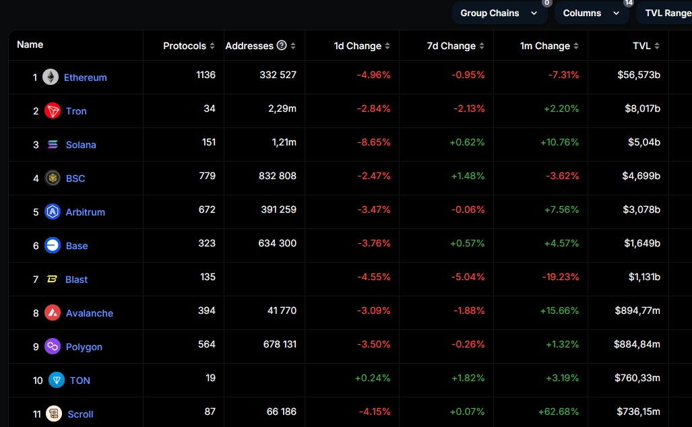

# Скрапінг даних із defillama

[defillama chains](https://defillama.com/chains)

Зміст:
1. [Аналіз особливостей WEB-сторінки](#web-page)
2. [Загальний алгоритм](#alg)
3. [Програмна реалізація](#code)
4. [Використання](#usage)

## 1. <span id="web-page" >Аналіз особливостей WEB-сторінки</span>

### Динамічний контент

У ході виконання даного завдання також було досліджено використання таких бібліотек, як `Beautiful Soup` та `Selenium`.

`Beautiful Soup` може бути використано для парсингу та аналізу __статичного__ HTML-коду. Це зручно, коли веб-сторінка не використовує JavaScript для динамічного оновлення або коли весь необхідний контент вже завантажений у HTML. При спробах скрапінгу засобами бібліотек `Beautiful Soup`+`Requests` не поверталися потрібні дані WEB-сторінки, звідки було зроблено висновок, що головна частина контенту прогружається динамічно з використанням JavaScript.

`Selenium` _підходить для роботи з динамічним контентом_, де JavaScript змінює сторінку після її початкового завантаження. Проте він показував дуже низьку швидкодію, тому _кращим вибором_ тут став `playwright`.

### Видимість елементів

Проаналізуємо відображення контенту:



При спробі отримати весь контент сторінки чи зразу необхідних елементів повертаються лише перші елементи, далі дані відсутні.

Також при спробі скролингу сторінки до її кінця були видимі лише останні елементи.

> __Висновок__: схоже, що на цій сторінці контент не підгружається динамічно у такий спосіб, який ми часто привикли бачити на сайтах. Ми можемо зчитати лише ті елементи, що є у видимій області, тобто ___необхідно парсити дані по мірі прокрутки сторінки.___

## 2. <span id="alg" >Загальний алгоритм</span>

1. Скролимо сторінку до кінця, щоб знайти __номер останнього елементу__ (`last_element_number`) (можна було би використати константе значення, просто взявши його самим, але це зроблено на випадок зміни кількості рядків)
2. Повертаємося на __початок сторінки__
3. Зчитуємо __максимальну кількість__ необхідних доступних __елементів__
4. Перевіряємо чи __немає у полі видимості `last_element_number`__ (тобто це означає, що всі елементи були зчитані і можна завершувати алгоритм)
5. Скролимо сторінку до __останнього зчитаного елемента__
6. Повторюємо __кроки 4 та 5__ до завершення

Водночас з цим записуємо дані у DataFrame і робимо перевірку на дублікати, оскільки контент догружається нерівномірно і важко встановити конкретного з якого моменту у наших даних виникатимуть копії.

## 3. <span id="code" >Програмна реалізація</span>

### Структура директорій

```
.
├── venv.py
│   ├── ...
│   └── ...
├── index.py
├── config.json
├── scraped_data.csv
├── scraping.log
└── README.md
```

- `index.py` містить головний код програми
- `config.json` містить дані конфігурації для використання proxy і встановлення часової паузи у роботі коду
- `scraped_data.csv` файл створюється автоматично, у нього записуються результати скрапінгу
- `scraping.log` описує історію логування
- файли папки `venv` створюються автоматично при використанні віртуального середовища, яке необхідне для запуску `playwright`

### index.py

```python
# імпортування бібліотек
import json
import time
import signal
import sys
import logging
from playwright.sync_api import sync_playwright
import pandas as pd
#  -------------------------------------------

# налаштування логування
logging.basicConfig(filename='scraping.log', level=logging.INFO, format='%(asctime)s - %(levelname)s - %(message)s')

#  -------------------------------------------
#  допоміжні функції

#  функція прокрутки до кінця сторінки
def scroll_to_bottom(page):
    try:
        last_height = page.evaluate('document.body.scrollHeight')
        attempts = 0
        max_attempts = 5
        while attempts < max_attempts:
            page.evaluate('window.scrollTo(0, document.body.scrollHeight)')
            time.sleep(2)
            new_height = page.evaluate('document.body.scrollHeight')
            if new_height == last_height:
                attempts += 1
            else:
                attempts = 0
                last_height = new_height
        logging.info("Reached the bottom of the page or maximum scroll attempts")
    except Exception as e:
        logging.error(f"Error while scrolling to bottom: {e}")
        
        
#  функція отримання останнього номеру рядка
def get_last_element_number(page):
    try:
        last_span = page.query_selector('span.sc-f61b72e9-0.iphTVP >> nth=-1 >> span')
        return int(last_span.inner_text()) if last_span else 0
    except Exception as e:
        logging.error(f"Error while getting last element number: {e}")
        return 0

#  функція прокрутки до елемента
def scroll_to_element(page, element_number):
    try:
        page.evaluate(f'''
        const elements = document.querySelectorAll('span.sc-f61b72e9-0.iphTVP > span');
        for (const element of elements) {{
            if (element.innerText === '{element_number}') {{
                element.scrollIntoView();
                break;
            }}
        }}
        ''')
        time.sleep(2)
    except Exception as e:
        logging.error(f"Error while scrolling to element {element_number}: {e}")
# -------------------------------------------

#  основна функція скрапінгу даних
def main(proxy_server=None, proxy_username=None, proxy_password=None):
    try:
        with sync_playwright() as p:
            # підготовка проксі налаштувань, якщо вони надані
            proxy_settings = {}
            if proxy_server:
                proxy_settings["server"] = proxy_server
                if proxy_username and proxy_password:
                    proxy_settings["username"] = proxy_username
                    proxy_settings["password"] = proxy_password

            # ініціалізація браузера з проксі або без нього
            if proxy_settings:
                browser = p.chromium.launch(headless=False, proxy=proxy_settings)
                context = browser.new_context(proxy=proxy_settings)
            else:
                browser = p.chromium.launch(headless=False)
                context = browser.new_context()
            
            page = context.new_page()
            
            logging.info('Navigating...')
            page.goto('https://defillama.com/chains')
            logging.info('Navigated! Starting to scrape...')
            
            # гортаємо до кінця сторінки, щоб отримати номер останнього елемента
            scroll_to_bottom(page)
            last_element_number = get_last_element_number(page)
            logging.info(f"Last element number: {last_element_number}")
            
            # гортаємо назад на початок
            page.evaluate('window.scrollTo(0, 0)')
            time.sleep(2)
            
            data = []
            current_element = 0
            
            # зчитуємо дані до останнього елемента
            while current_element < last_element_number:
                try:
                    # стовпець Name
                    elements  = page.query_selector_all("a.sc-8c920fec-3.dvOTWR")
                    # стовпець Protocol
                    protocols = page.query_selector_all('//*[@id="__next"]/div[1]/div/main/div[2]/div[4]/div[2]/div/div[2]')
                    # стовпець Tvl
                    tvls      = page.query_selector_all('//*[@id="__next"]/div[1]/div/main/div[2]/div[4]/div[2]/div/div[7]')
                    
                    # прохід по знайденим елементам
                    for i, element in enumerate(elements):
                        name = element.inner_text()
                        link = element.get_attribute('href')
                        
                        new_data = {
                            'Name': name,
                            'Link': link,
                            'Protocols': protocols[i].inner_text() if i < len(protocols) else '',
                            'TVL': tvls[i].inner_text() if i < len(tvls) else ''
                        }
                        
                        # перевірка на наявні копії
                        duplicate = next((item for item in data if item['Name'] == name), None)
                        if duplicate:
                            data.remove(duplicate)
                        else:
                            current_element += 1
                            
                        data.append(new_data)
                        logging.info(f"Scraped: {name}")
                        
                        # завершуємо цикл, якщо останній елемент вже був зчитаний
                        if current_element >= last_element_number:
                            break
                
                except Exception as e:
                    logging.error(f"Error during scraping elements: {e}")
                
                # переходимо до останнього спарсеного елемента
                scroll_to_element(page, str(current_element))
            
            df = pd.DataFrame(data)
            
            # фінальна перевірка на наявність дублікатів
            df.drop_duplicates(subset=['Name'], keep='first', inplace=True)
            
            logging.info(f"Data scraped successfully. Total unique elements: {len(df)}")
            
            # запис даних у файл csv
            df.to_csv('scraped_data.csv', index=False)
            logging.info('Data saved to scraped_data.csv')
            
            # закриття браузера
            browser.close()
    
    except Exception as e:
        logging.error(f"Unexpected error: {e}")

# -------------------------------------------

#функція призупинення роботи скрипта через обробника сигналів
def signal_handler(sig, frame):
    logging.info('Stopping the script...')
    sys.exit(0)

if __name__ == "__main__":
    # встановлення обробника сигналів
    signal.signal(signal.SIGINT, signal_handler)
    signal.signal(signal.SIGTERM, signal_handler)

    while True:
        try:
            # завантаження параметрів з файлу config.json
            with open('config.json', 'r') as config_file:
                config = json.load(config_file)
            
            # передача параметрів проксі в main
            main(
                proxy_server=config.get('proxy_server'),
                proxy_username=config.get('proxy_username'),
                proxy_password=config.get('proxy_password')
            )
            
            # отримання інтервалу з конфігураційного файлу
            interval = config.get('scrape_interval_minutes', 5)  # значення за замовчуванням 5 хвилин
            logging.info(f"Waiting for {interval} minutes before the next scrape...")
            
            # очікування перед наступним виконанням
            time.sleep(interval * 60)
        
        except Exception as e:
            logging.error(f"Error in main loop: {e}")
            time.sleep(60)  # запобігаємо безперервний цикл

```

А тепер детальніше по кроках

#### Бібліотеки

```python
# імпортування бібліотек
import json
import time
import signal
import sys
import logging
from playwright.sync_api import sync_playwright
import pandas as pd
#  -------------------------------------------
```

Тут варто звернути увагу на:
- `time` буде використовуватися для створення пауз у роботі, зокрема і для можливості автоматичного запуску роботи коду кожні 5хв  
- `signal` та `sys` для можливості повністю перервати роботу із консолі (наприклад, коли потрібно зупинити скрипт натисканням Ctrl+C)

#### signal_handler

```python
def signal_handler(sig, frame):
    logging.info('Stopping the script...')
    sys.exit(0)
```

`signal_handler` забезпечує коректне завершення скрипту при отриманні певних сигналів, наприклад, коли ви натискаєте Ctrl+C в консолі. Без цієї функції скрипт може не зупинятися коректно або залишати деякі ресурси відкритими. Також тут ми виводимо та записуємо додаткові повідомлення про роботу програми (```'Stopping the script...'```)

#### main
```python
#  основна функція скрапінгу даних
def main(proxy_server=None, proxy_username=None, proxy_password=None):
    try:
        with sync_playwright() as p:
            # підготовка проксі налаштувань, якщо вони надані
            proxy_settings = {}
            if proxy_server:
                proxy_settings["server"] = proxy_server
                if proxy_username and proxy_password:
                    proxy_settings["username"] = proxy_username
                    proxy_settings["password"] = proxy_password

            # ініціалізація браузера з проксі або без нього
            if proxy_settings:
                browser = p.chromium.launch(headless=False, proxy=proxy_settings)
                context = browser.new_context(proxy=proxy_settings)
            else:
                browser = p.chromium.launch(headless=False)
                context = browser.new_context()
            
            page = context.new_page()
            
            logging.info('Navigating...')
            page.goto('https://defillama.com/chains')
            logging.info('Navigated! Starting to scrape...')
            
            # гортаємо до кінця сторінки, щоб отримати номер останнього елемента
            scroll_to_bottom(page)
            last_element_number = get_last_element_number(page)
            logging.info(f"Last element number: {last_element_number}")
            
            # гортаємо назад на початок
            page.evaluate('window.scrollTo(0, 0)')
            time.sleep(2)
            
            data = []
            current_element = 0
            
            # зчитуємо дані до останнього елемента
            while current_element < last_element_number:
                try:
                    # стовпець Name
                    elements  = page.query_selector_all("a.sc-8c920fec-3.dvOTWR")
                    # стовпець Protocol
                    protocols = page.query_selector_all('//*[@id="__next"]/div[1]/div/main/div[2]/div[4]/div[2]/div/div[2]')
                    # стовпець Tvl
                    tvls      = page.query_selector_all('//*[@id="__next"]/div[1]/div/main/div[2]/div[4]/div[2]/div/div[7]')
                    
                    # прохід по знайденим елементам
                    for i, element in enumerate(elements):
                        name = element.inner_text()
                        link = element.get_attribute('href')
                        
                        new_data = {
                            'Name': name,
                            'Link': link,
                            'Protocols': protocols[i].inner_text() if i < len(protocols) else '',
                            'TVL': tvls[i].inner_text() if i < len(tvls) else ''
                        }
                        
                        # перевірка на наявні копії
                        duplicate = next((item for item in data if item['Name'] == name), None)
                        if duplicate:
                            data.remove(duplicate)
                        else:
                            current_element += 1
                            
                        data.append(new_data)
                        logging.info(f"Scraped: {name}")
                        
                        # завершуємо цикл, якщо останній елемент вже був зчитаний
                        if current_element >= last_element_number:
                            break
                
                except Exception as e:
                    logging.error(f"Error during scraping elements: {e}")
                
                # переходимо до останнього спарсеного елемента
                scroll_to_element(page, str(current_element))
            
            df = pd.DataFrame(data)
            
            # фінальна перевірка на наявність дублікатів
            df.drop_duplicates(subset=['Name'], keep='first', inplace=True)
            
            logging.info(f"Data scraped successfully. Total unique elements: {len(df)}")
            
            # запис даних у файл csv
            df.to_csv('scraped_data.csv', index=False)
            logging.info('Data saved to scraped_data.csv')
            
            # закриття браузера
            browser.close()
    
    except Exception as e:
        logging.error(f"Unexpected error: {e}")
```

###### proxy

- у `main` передаються аргументи (не обов'язкові) про налаштування проксі: 
```python
(proxy_server=None, proxy_username=None, proxy_password=None)
```
- далі перевіряється, чи були вказані дані для їх налаштування: 
```python
if proxy_server:
    proxy_settings["server"] = proxy_server
    if proxy_username and proxy_password:
        proxy_settings["username"] = proxy_username
        proxy_settings["password"] = proxy_password
```
- і в залежності, чи інформація для конфігурації проксі була передана, ми робимо відповідне з'єднання:
```python
# ініціалізація браузера з проксі або без нього
if proxy_settings:
    browser = p.chromium.launch(headless=False, proxy=proxy_settings)
    context = browser.new_context(proxy=proxy_settings)
else:
    browser = p.chromium.launch(headless=False)
    context = browser.new_context()
```

###### Витягування номеру останнього елемента

```python
# гортаємо до кінця сторінки, щоб отримати номер останнього елемента
scroll_to_bottom(page)
last_element_number = get_last_element_number(page)
logging.info(f"Last element number: {last_element_number}")

# гортаємо назад на початок
page.evaluate('window.scrollTo(0, 0)')
time.sleep(2)
```

###### Головний цикл

Головний цикл починається тут:
```python
while current_element < last_element_number:
```

Умова завершення:
```python
if current_element >= last_element_number:
    break
```
`current_element` - кількість записаних (унікальних) елементів.

#### Витягування даних про налаштування із config.json

```python
if __name__ == "__main__":
    # встановлення обробника сигналів
    signal.signal(signal.SIGINT, signal_handler)
    signal.signal(signal.SIGTERM, signal_handler)

    while True:
        try:
            # завантаження параметрів з файлу config.json
            with open('config.json', 'r') as config_file:
                config = json.load(config_file)
            
            # передача параметрів проксі в main
            main(
                proxy_server=config.get('proxy_server'),
                proxy_username=config.get('proxy_username'),
                proxy_password=config.get('proxy_password')
            )
            
            # отримання інтервалу з конфігураційного файлу
            interval = config.get('scrape_interval_minutes', 5)  # значення за замовчуванням 5 хвилин
            logging.info(f"Waiting for {interval} minutes before the next scrape...")
            
            # очікування перед наступним виконанням
            time.sleep(interval * 60)
        
        except Exception as e:
            logging.error(f"Error in main loop: {e}")
            time.sleep(60)  # запобігаємо безперервний цикл
```

Тут ми зчитуємо `config.json`:
```python
with open('config.json', 'r') as config_file:
    config = json.load(config_file)
```

і передаємо параметри проксі у `main`:
```python
main(
    proxy_server=config.get('proxy_server'),
    proxy_username=config.get('proxy_username'),
    proxy_password=config.get('proxy_password')
)
```

Ось як може виглядати `config.json` без додаткових налаштувань:
```json
{
  "proxy_server": "",
  "proxy_username": "",
  "proxy_password": "",
  "scrape_interval_minutes": 5
}
```

#### Автоматичне повторювання коду
```python
# отримання інтервалу з конфігураційного файлу
interval = config.get('scrape_interval_minutes', 5)  # значення за замовчуванням 5 хвилин
logging.info(f"Waiting for {interval} minutes before the next scrape...")
```

## 4. <span id="usage">Використання</span>

Для запуску буде необхідно інсталювати відповідні бібліотеки і встановити браузери для `playwright` (робити це у віртуальному середовищі):

1. Відкрийте командний рядок (CMD) або PowerShell від імені Адміністратора
2. Перейдіть до папки проекту:
```
cd шлях\до\вашої\папки\проекту
```
3. Активуйте віртуальне середовище:

- Для Windows (CMD):
```
venv\Scripts\activate
```
- Для Windows (PowerShell):
```
.\venv\Scripts\Activate.ps1
```

4. Встановлення Playwright
```
pip install playwright
```

5. Запуск скрипта
```
python -u "index.py"
```

> [!WARNING]
> Інколи можуть бути випадки, коли код призупиняється на етапі на моменті:
```
Navigating...
Navigated! Starting to scrape...
```
або:
```
Navigating...
Navigated! Starting to scrape...
Last element number: 304
```
> Якщо таке виникне, спробуйте натистнути `Ctrl+C` один раз для подальшої роботи.